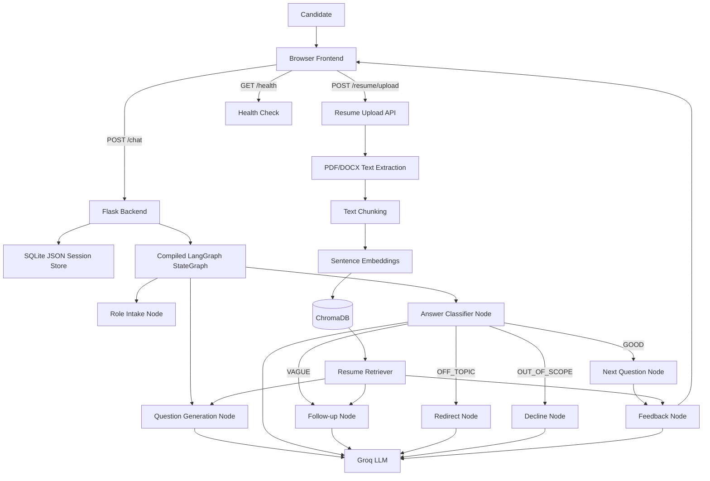

# Interview Practice Partner: Complete Project Explanation

## 1. Project Overview

Interview Practice Partner is an AI-powered mock interview application. It conducts role-specific interviews through text or voice and generates structured feedback after the interview.

The application can:

- Identify the job role the user wants to practice.
- Ask staged and role-specific interview questions.
- Use the candidate's resume to create more relevant questions.
- Detect vague, off-topic, or inappropriate answers.
- Ask follow-up questions when an answer lacks detail.
- Redirect the candidate when they leave the topic.
- Generate a readiness score and detailed performance feedback.
- Accept both typed answers and browser microphone input.

The system has two major parts:

1. A Python Flask backend that manages sessions, interview state, LLM calls, and resume processing.
2. A vanilla JavaScript frontend that displays the interview and handles text, voice, and feedback interactions.

---

## 2. High-Level Architecture



The interview is interactive, so the backend does not run the complete interview in a single request. It executes only the nodes needed for the current turn and stores the next node in the session state.

---

## 3. Directory Structure

```text
interview_practice_partner/
|
|-- README.md
|-- PROJECT_EXPLANATION.md
|
|-- backend/
|   |-- app.py
|   |-- requirements.txt
|   |
|   |-- graph/
|   |   |-- graph.py
|   |   |-- llm.py
|   |   |-- nodes.py
|   |   |-- prompts.py
|   |   |-- state.py
|   |
|   |-- rag/
|   |   |-- chunker.py
|   |   |-- embeddings.py
|   |   |-- extractor.py
|   |   |-- retriever.py
|   |   |-- vector_store.py
|   |
|   |-- chroma_db/
|   |-- tests/
|       |-- test_resume_extraction.py
|
|-- frontend/
    |-- index.html
    |-- app.js
    |-- style.css
```

---

## 4. Frontend Architecture

### `frontend/index.html`

Defines the user interface:

- Header and connection status.
- Conversation transcript.
- Text input and send button.
- Microphone recording button.
- Resume upload control.
- Interview progress bar.
- End interview button.
- Feedback cards and readiness score.
- Restart and copy-feedback controls.

The page loads `style.css` and `app.js`.

### `frontend/style.css`

Contains the complete visual design. It styles the dark interface, conversation bubbles, buttons, status badges, progress bar, resume controls, feedback cards, notifications, and responsive behavior.

### `frontend/app.js`

Contains all browser-side application logic.

Its main responsibilities are:

- Create a unique session ID for each page load.
- Send messages to the backend.
- Render user and interviewer messages.
- Disable input while waiting for the LLM.
- Read progress information returned by the backend.
- Upload resumes.
- Use `SpeechRecognition` for speech-to-text.
- Use `SpeechSynthesis` for text-to-speech.
- Display feedback returned by the backend.
- Retry temporary network or rate-limit failures.
- Check whether the backend is available.

The frontend uses this backend URL:

```javascript
const BACKEND_URL = 'http://localhost:5000';
```

### Frontend conversation flow

```text
Page loads
   |
   v
Create session ID
   |
   v
User types or speaks
   |
   v
POST /chat
   |
   v
Display interviewer response
   |
   v
Speak response through browser TTS
   |
   v
Wait for next answer
```

Text input is always available. Voice is optional and depends on browser support and microphone permission.

---

## 5. Backend Architecture

### `backend/app.py`

This is the Flask entry point. It provides the HTTP API and coordinates the SQLite session store with the compiled LangGraph.

The session store has this general shape:

```python
sessions.sqlite stores one JSON-serialized InterviewState per session_id.
```

The backend limits the number of stored sessions to prevent unlimited memory growth.

### Compiled graph execution

The `run_turn()` function in `app.py` resumes the compiled graph for one conversation turn.

It:

1. Loads the JSON state from SQLite.
2. Uses the session ID as the LangGraph checkpoint thread ID.
3. Injects the new user message and resumes the interrupted graph.
4. Lets conditional edges route between the existing nodes.
5. Stores the updated state back in SQLite.
6. Returns the interviewer response to the frontend.

The graph has an important stage guard. Once a role is confirmed, its entry router prevents the workflow from returning to role selection if the candidate later mentions a job title in an answer.

---

## 6. API Endpoints

### `GET /health`

Used by the frontend to check whether Flask is running.

Example response:

```json
{
  "status": "ok",
  "sessions": 1
}
```

### `POST /chat`

Main interview endpoint.

Request:

```json
{
  "session_id": "ipp-123456",
  "message": "I want to practice for a Software Engineer role"
}
```

Response:

```json
{
  "session_id": "ipp-123456",
  "response": "Great choice! Let's begin your Software Engineer interview.",
  "done": false,
  "feedback": null,
  "state_info": {
    "role": "Software Engineer",
    "role_confirmed": true,
    "main_question_count": 0,
    "max_questions": 7,
    "interview_stage": "INTERVIEW_ACTIVE",
    "current_node": "classify_answer_node"
  }
}
```

### `POST /feedback`

Generates feedback from the current session or from a supplied transcript.

### `POST /resume/upload`

Accepts a PDF or DOCX resume. The file is extracted, chunked, embedded, and stored for the current session.

The upload is limited to 5 MB.

### `POST /new_session`

Creates a new session and returns a new session ID.

---

## 7. Interview State Model

The state schema is defined in `backend/graph/state.py`.

Important fields include:

| Field | Purpose |
|---|---|
| `session_id` | Identifies the interview session |
| `role` | Selected job role |
| `role_confirmed` | Prevents role re-detection later |
| `main_question_count` | Number of completed main questions |
| `follow_up_count` | Number of follow-up questions |
| `is_follow_up` | Identifies whether the current exchange is a follow-up |
| `max_questions` | Maximum number of questions |
| `interview_stage` | Current stage of the interview |
| `previous_questions` | Prevents duplicate questions |
| `user_answers` | Stores candidate answers |
| `current_question` | Question currently being answered |
| `history` | Full conversation history |
| `classification` | Last answer classification |
| `next_node` | Next node to execute |
| `feedback` | Final structured feedback |
| `done` | Indicates interview completion |
| `resume_uploaded` | Indicates whether a resume is available |

---

## 8. Interview Graph

The graph implementation is split across:

- `backend/graph/state.py`: state schema.
- `backend/graph/nodes.py`: node behavior.
- `backend/graph/graph.py`: formal LangGraph topology.
- `backend/graph/prompts.py`: LLM prompts.
- `backend/graph/llm.py`: Groq API wrapper.

The graph follows this flow:

```text
START
  |
  v
role_intake_node
  |
  v
ask_question_node
  |
  v
classify_answer_node
  |
  +-- GOOD ----------> next_question_node
  |                         |
  |                         +--> ask_question_node
  |                         |
  |                         +--> generate_feedback_node
  |
  +-- VAGUE ---------> follow_up_node
  |                         |
  |                         +--> classify_answer_node
  |
  +-- OFF_TOPIC -----> redirect_node
  |                         |
  |                         +--> classify_answer_node
  |
  +-- OUT_OF_SCOPE --> decline_node
                            |
                            +--> classify_answer_node
```

The graph is compiled by `graph.py` and executed by Flask. `interrupt_before` pauses at nodes that consume the next candidate message, and SQLite-backed checkpoints allow the same thread to resume on the next request. The `next_node` field is retained for diagnostics and API state information, not dispatch.

---

## 9. Graph Nodes

### 9.1 `role_intake_node`

Extracts a job role from the user's message.

It first uses lightweight role extraction logic for common role names. If no role is found, it calls the LLM to ask the user for clarification.

Once a role is detected:

```text
role_confirmed = True
interview_stage = INTERVIEW_ACTIVE
next_node = ask_question_node
```

### 9.2 `ask_question_node`

Generates the next interview question.

It considers:

- Selected role.
- Current interview stage.
- Previous questions.
- Previous answers.
- Resume context, if available.

It also calls a role-alignment validator to check whether the generated question belongs to the selected role. If validation fails, it retries with a stricter prompt.

### 9.3 `classify_answer_node`

Classifies the candidate answer as one of:

- `GOOD`: relevant and sufficiently detailed.
- `VAGUE`: too short or lacking specific evidence.
- `OFF_TOPIC`: unrelated to the question.
- `OUT_OF_SCOPE`: asks the system to perform a non-interview task.

The classifier returns structured JSON to make routing predictable.

### 9.4 `follow_up_node`

Asks for more detail when an answer is vague.

Example:

```text
Candidate: I improved the system.
Interviewer: What specific change did you make, and how did you measure the improvement?
```

The follow-up does not represent a new main question.

### 9.5 `next_question_node`

Handles a good answer and decides whether to continue or finish.

The interview normally contains seven main questions:

1. Introduction
2. Project discussion
3. Project discussion
4. Technical fundamentals
5. Technical fundamentals
6. System design
7. Behavioral

A stop request is accepted only after at least three questions have been answered.

### 9.6 `redirect_node`

Handles answers unrelated to the current question and politely redirects the candidate.

### 9.7 `decline_node`

Handles requests outside the interview, such as asking the assistant to write a resume or provide the answer directly.

It declines while remaining in the interviewer persona.

### 9.8 `generate_feedback_node`

Analyzes the complete transcript and returns structured JSON containing:

- `readinessScore`
- `overallImpression`
- `communication`
- `technicalKnowledge`
- `strengths`
- `improvementAreas`

The score is restricted to the range 1 through 10.

---

## 10. Interview Stages

The interview stages are calculated from the number of completed main questions:

| Question | Stage | Focus |
|---|---|---|
| Q1 | Introduction | Candidate background and relevant experience |
| Q2-Q3 | Project Discussion | Projects, internships, certifications, decisions, and outcomes |
| Q4-Q5 | Technical Fundamentals | Role-specific concepts and technical knowledge |
| Q6 | System Design | Architecture, scalability, and design decisions |
| Q7 | Behavioral | Teamwork, conflict, communication, and deadlines |

The exact topics are controlled by prompts in `backend/graph/prompts.py`.

---

## 11. LLM Integration

### `backend/graph/llm.py`

The project uses the Groq Python SDK.

The configured model is:

```text
llama-3.3-70b-versatile
```

The API key is loaded from:

```text
GROQ_API_KEY
```

There are two main helper functions:

- `chat_completion()`: normal interviewer responses.
- `structured_completion()`: JSON responses for classification, validation, and feedback.

The wrapper also provides:

- Rate-limit retries using Tenacity.
- Error handling.
- Conversation history truncation to reduce token usage.
- Lazy client initialization.

### `backend/graph/prompts.py`

Stores all system prompts and role-specific topic lists. Centralizing prompts makes it easier to change interviewer behavior without editing node logic.

---

## 12. Resume RAG Pipeline

Resume support is implemented in `backend/rag/`.

### Step 1: Text extraction

`extractor.py` reads PDF and DOCX files.

- PDF files are processed with `pypdf`.
- DOCX files are processed with `python-docx`.
- Whitespace is normalized.
- Empty or unreadable documents are rejected.

### Step 2: Chunking

`chunker.py` splits the resume into overlapping text chunks.

Default values:

```text
Chunk size: 500 characters
Chunk overlap: 100 characters
```

### Step 3: Embedding generation

`embeddings.py` uses the `all-MiniLM-L6-v2` sentence-transformer model to convert each chunk into a vector.

### Step 4: Vector storage

`vector_store.py` stores the vectors in a local ChromaDB collection named `resume_chunks`.

Every chunk receives the session ID as metadata. This prevents one session's resume from being retrieved for another session.

### Step 5: Retrieval

`retriever.py` creates a search query using the selected role and conversation history. It retrieves the most relevant resume chunks.

Retrieved chunks are added to prompts for:

- Question generation.
- Follow-up generation.
- Final feedback generation.

This is called retrieval-augmented generation, or RAG.

---

## 13. Complete User Request Flow

### Starting an interview

1. The browser loads `index.html`.
2. `app.js` creates a session ID.
3. The user types or speaks a desired role.
4. The frontend sends the role to `/chat`.
5. Flask creates a session state.
6. `role_intake_node` extracts and confirms the role.
7. `ask_question_node` generates the first question.
8. Flask returns the question to the browser.
9. The browser displays and optionally speaks the question.

### Answering a question

1. The user submits an answer.
2. The frontend sends it to `/chat` using the same session ID.
3. Flask loads the saved state.
4. `classify_answer_node` evaluates the answer.
5. The appropriate node handles the result.
6. The state is updated.
7. The response is returned to the browser.

### Ending an interview

1. The user clicks `End Interview` or sends a stop phrase.
2. The backend verifies that at least three questions were answered.
3. If enough questions exist, feedback generation begins.
4. The transcript and optional resume context are sent to the LLM.
5. Structured feedback is returned.
6. The frontend displays the score and feedback cards.

---

## 14. Dependencies

Dependencies are listed in `backend/requirements.txt`.

Main packages:

- Flask: web server and API routes.
- Flask-CORS: frontend/backend communication during local development.
- Groq: LLM access.
- LangGraph: graph definition and orchestration support.
- Tenacity: retry logic.
- pypdf: PDF extraction.
- python-docx: DOCX extraction.
- sentence-transformers: resume embeddings.
- ChromaDB: vector storage.
- LangChain text splitters: resume chunking.

---

## 15. Running the Project

Create and activate a virtual environment:

```powershell
python -m venv venv
venv\Scripts\activate
```

Install dependencies:

```powershell
pip install -r backend/requirements.txt
```

Set the Groq API key:

```text
GROQ_API_KEY=your_api_key_here
```

Start the backend:

```powershell
cd backend
python app.py
```

The backend runs at:

```text
http://localhost:5000
```

Then open `frontend/index.html` in a browser.

Chrome or Edge is recommended for microphone support.

---

## 16. Testing

The current automated test is:

```text
backend/tests/test_resume_extraction.py
```

It verifies that text can be extracted from a DOCX resume.

Additional useful tests would cover:

- Role extraction.
- Stop-signal detection.
- Question-count increments.
- Minimum-question enforcement.
- Classification routing.
- Feedback fallback behavior.
- PDF extraction.
- Resume session isolation.
- Flask API responses.

---

## 17. Current Limitations

- Session JSON and LangGraph checkpoints use local SQLite files.
- Local SQLite files are suitable for one backend process; a multi-process deployment would need shared storage.
- The application is intended for local or demo use.
- Voice input depends on browser support and microphone permissions.
- Scanned PDFs without selectable text cannot be processed.
- The role topic list covers common roles more thoroughly than unusual roles.
- LLM output is nondeterministic.
- Resume embeddings are stored locally in ChromaDB.
- The frontend assumes the backend runs on port 5000.
- Adaptive difficulty currently changes between easy, medium, and hard based on answer classification and strength.

---

## 18. Summary

The project combines four main ideas:

1. A browser-based interview interface.
2. A stateful Flask conversation backend.
3. A node-based LLM interview workflow.
4. A resume RAG pipeline for personalized questions.

The central design is the persistent `InterviewState`. Every user message updates that state, and the `next_node` field determines what the backend should do next. This allows the interview to pause naturally after every question while preserving the role, transcript, counters, classification, resume context, and final feedback.
